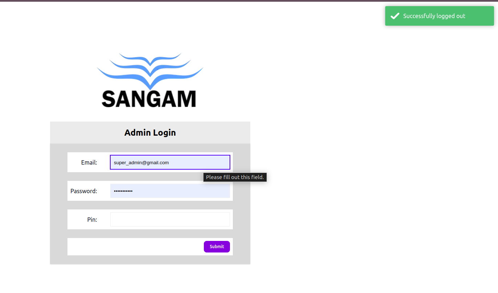

## Notes

1. For notification, this project uses toastrjs.
2. For editor, this project uses tinymce v5 (maybe v7 I forgot).
3. For email, there is no implementation yet.
4. For database, migration files are available.
5. For login details, seed the seeder files.

## Code Details

Php  version : ^8.3.8,

Laravel version : ^11

## Backup Latest Details

Last Code Backup : 07/27/2024

## Backup Previous Details

Previous Code Backup : --/--/---- (MM/DD/YYYY)

## Steps for cloning

1. `git clone https://github.com/143Sangam143/Bus-Management-System.git`
2. `composer install`
3. Create database name portfolio in phpmyadmin
4. `cp .env.example .env`
5. `php artisan migrate:fresh --seed`
6. `npm install`

## Steps to run project

1. `php artisan serve`
2. `npm run dev`

## How to use tinymce editor

1. You will use tinymce editor by only adding its class in textarea field
2. Eg => ```<textarea class="my-editor"></textarea>```
3. "my-editor" is the class name defined by me for tinymce editor in my project.
   
## Result


## How to use toastrjs for notification

1. For session etc
    ```
    return redirect()->route('login')->with([
        'success' => true,
        'message' => 'Account registered successfully'
    ]);
    ```
2. For ajax etc
    ```
    return response()->json([
        'error' => true,
        'message' => 'Role or Permission not found.'
    ]);
    ```
3. After above of ajax code things to do in success function or error function
    ```
    $.ajax({
        method: 'get',
        url: url,
        success:function(res){
            ajax_response(res);
        }
    });
    ```
Note : : 
1. This project supports four notificationtypes i.e success, error, info, warning. 
   And to display info, warning all you need to do is replace the notificationtype
   i.e "'success' => true," get changes to "'info' => true," when you want to display
   info.
2. ajax_response(res) is a function developed by me in the project it is not a inbuilt function.

## Result



## URL for login

for admin login
<br>

```http://localhost:8000/admins```

<br>

Credentials :: 
```
[
    username => admin@gmail.com,
    password => admin@admin,
    pin => 1322
]
```
<br>

for normal user login
<br>

```http://localhost:8000/login```

<br>

Credentials ::
```
[
    username => katwalsangam@gmail.com,
    password => admin@admin
]
```
## Special notes for developer : : about project 

This project is in laravel 11 with working tinymce editor for textarea and toastrjs for notification.
Also note that the filemanager for tinymce has not been set so it may not work. APP_DEBUG is set to 
false. So, to see error set APP_DEBUG to true.

If you don't want to see the "Sangam" logo in the login, register and admin page. I suggest you 
to create data in site-setting which is a menu in the admin panel from where basic information of
the project can be set such as website name, logo, welcome text, copyright text etc.
